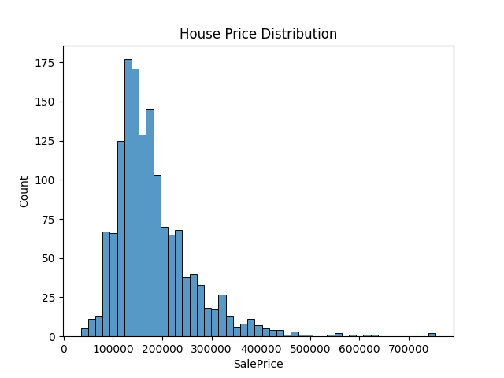
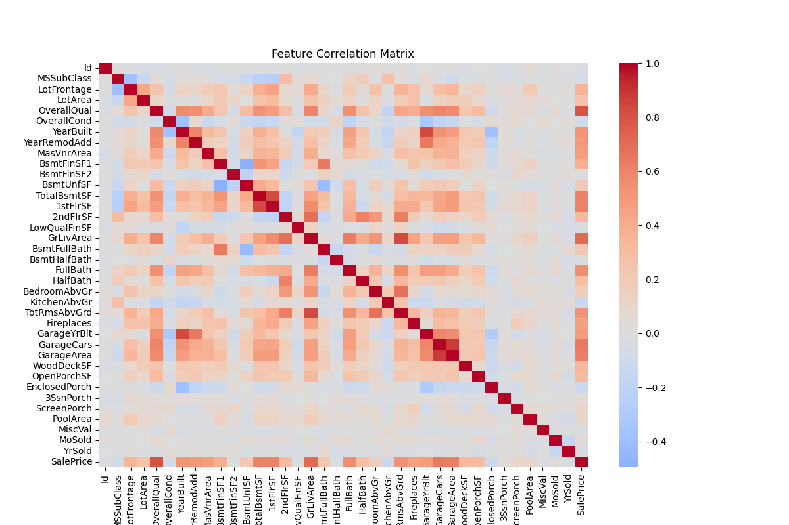
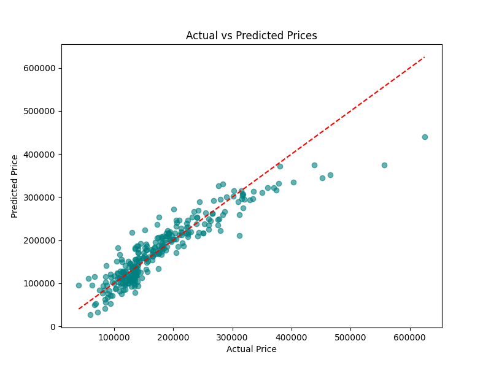
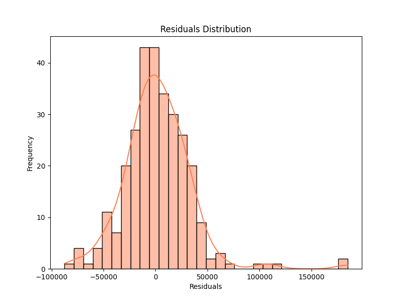

# House Price Prediction

A complete pipeline for predicting house prices using machine learning. This project includes data preprocessing, feature engineering, model training, evaluation, and visualization.

## Features
- Data cleaning and feature engineering
- Linear Regression model (easy to extend to RandomForest/XGBoost)
- Model evaluation (RMSE, R²)
- Automated visualizations for report
- End-to-end pipeline with CLI
- Unit tests for all major components

## Project Structure
```
house_price_prediction/
├── data/
│   ├── raw/train.csv
│   └── processed/cleaned_data.csv
├── models/
│   ├── trained_model.pkl
│   └── scaler.pkl
├── src/
│   ├── data/
│   │   ├── __init__.py
│   │   ├── make_dataset.py
│   │   └── preprocess.py
│   ├── models/
│   │   ├── __init__.py
│   │   ├── train_model.py
│   │   └── predict_model.py
│   
├── notebooks/
├── reports/
└── requirements.txt
```

## How to Run
1. Install dependencies:
   ```bash
   pip install -r requirements.txt
   ```
2. Run the pipeline:
   ```bash
   python main.py
   ```
   This will preprocess data, train the model, evaluate, and generate visualizations.
3. Run tests:
   ```bash
   pytest tests/
   ```

## Visualizations
Generated in `reports/figures/`:
- 
- 
- 
- 

## Next Steps
- Add CLI/GUI for batch predictions on new data
- Try advanced models (RandomForest, XGBoost)
- Deploy as a web app (Streamlit, Flask, FastAPI)

## License
MIT